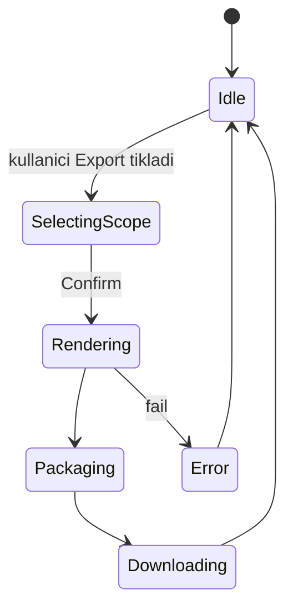

# Framelaunch — Build Prompt / Spec

> Bu doküman, **Framelaunch** ürününü sıfırdan inşa etmek için tek başına yeterli bir build prompt'udur.
> Bir AI ajana veya geliştiriciye verildiğinde, aşağıdaki bölümleri sırayla uygulayarak production-ready bir uygulama elde edilebilir.
>
> **Referans ürün:** [yuzu-hub/appscreen](https://yuzu-hub.github.io/appscreen/) (MIT)
> **Marka palet referansı:** [linkhiver.com](https://linkhiver.com/)

---

## 1. Ürün Özeti & Hedef Kitle

**Framelaunch**, indie geliştiriciler, mobil uygulama yapımcıları ve pazarlamacılar için tarayıcıda çalışan, **kayıt gerektirmeyen, tamamen ücretsiz** bir **App Store / Play Store / sosyal medya screenshot oluşturucusu**dur. Kullanıcı kendi ekran görüntülerini yükler, Framelaunch onları cihaz çerçeveleri içine yerleştirir, üzerine pazarlama metni, gradient arka planlar, emoji/icon süsleri, popout büyütme efektleri ekler ve App Store'a yükleyebileceği yüksek çözünürlüklü görseller olarak dışa aktarır.

**Hedef Kitle:**

- **Indie iOS / Android geliştiricileri** — App Store Connect / Google Play Console için 14 farklı ekran boyutuna ihtiyaç duyanlar.
- **Solo / küçük ekipli SaaS pazarlamacıları** — Open Graph, Twitter Card, website hero, Product Hunt, Feature Graphic gibi marketing varlıkları üretenler.
- **No-code / vibe-coder topluluğu** — Tasarımcı kiralamadan profesyonel görünümlü mağaza görselleri isteyenler.

**Ürünün vaadi:** "5 dakikada App Store'a yüklemeye hazır 14 boyutta screenshot. Tarayıcıda. Tamamen ücretsiz, hesap yok."

**Mimari ilke:** %100 client-side. Hesap yok, backend yok, sunucu state'i yok. Tüm veri kullanıcının tarayıcısında (`localStorage` + `IndexedDB`) yaşar.

---

## 2. Kapsam (V1)

### Dahil

- Editör (yuzu-hub/appscreen feature parity, aşağıda matris).
- 30+ profesyonel başlangıç şablonu (kategori bazlı).
- Landing sayfası, templates galerisi.
- TR + EN UI (next-intl, default TR).
- PNG / JPG / WebP export, çoklu dosya için ZIP.
- localStorage + IndexedDB tabanlı persistence.
- Project export/import `.framelaunch.zip` (cihazlar arası taşıma).

### Hariç (V1)

- **Hesap, login, backend** — yok. Tüm uygulama statik hosting (Vercel/CF Pages/Netlify) ile yayınlanır.
- **Ücret, abonelik, watermark** — yok. Tüm özellikler herkese açık.
- Cloud project sync, takım işbirliği, gerçek zamanlı çoklu kullanıcı düzenleme.
- Video / animasyon export, ekran kayıt.
- AI içerik üretimi (yuzu'nun AI çevirisi V1 dışında — V2'de değerlendirilebilir).
- Embed / paylaşılabilir public proje URL'leri.
- API erişimi.

### Feature Parity Matrisi (referans → V1)

| Referans Özelliği | V1 Durumu | Not |
| --- | --- | --- |
| 14 cihaz/marketing boyutu | ✅ Var | §5.1 listesi |
| Custom boyut | ✅ Var | |
| 2D cihaz çerçeveleri (iPhone/Samsung) | ✅ Var | SVG sprite |
| 3D cihaz çerçeveleri | ➖ V1.5 (Phase 4) | CSS 3D transform; V1'de toggle disabled (tooltip "Yakında") |
| Gradient / Solid / Image arka plan | ✅ Var | |
| Background blur / overlay / noise | ✅ Var | |
| Headline + Subheadline (font, weight, position) | ✅ Var | |
| Per-language layout | ✅ Var | Aynı screenshot, her dil için ayrı text/asset |
| Element (graphic / text / emoji / icon) | ✅ Var | Lucide icon seti, native emoji |
| Popout (crop & magnify) | ✅ Var | |
| Çoklu proje | ✅ Var | localStorage |
| Çoklu dil proje içeriği | ✅ Var | TR/EN/DE/ES/FR/JA/PT seçilebilir |
| AI çeviri (Claude/OpenAI/Gemini) | ❌ V2 | |
| Old format → new format migration | ✅ Var | Helper |
| ZIP export (çoklu dil klasör/dosya) | ✅ Var | jszip |
| Apply style to all | ✅ Var | |
| 30+ template kütüphanesi | ➕ Yeni | Framelaunch farklılaştırıcısı |
| Proje export/import (`.framelaunch.zip`) | ➕ Yeni | Cihazlar arası taşıma (Phase 4) |

---

## 3. Marka & Tasarım Sistemi

### 3.1 Renk Paleti

Üç renkli minimal/cesur sistem: **sarı + siyah + beyaz**. linkhiver.com'un kontrast
yaklaşımına yakın bir his (güçlü kontrast, monokrom yüzey + tek bir vurgu rengi).

| Token | Hex | Kullanım |
| --- | --- | --- |
| `brand.primary` | `#E8C610` | Tek vurgu rengi: birincil CTA, focus ring, badge, brand wordmark "launch" |
| `brand.primaryHover` | `#D1B00D` | CTA hover durumu (≈ %10 daha koyu) |
| `brand.primarySoft` | `#FFF5B8` | Çok soft sarı; gradient ikinci durağı, hover halo |
| `brand.deep` | `#000000` | Brand siyah (CTA üzerinde text, hero bg) |
| `brand.deepest` | `#000000` | Aynı; gradient en koyu durağı |
| `success.base` | `#11998E` | Success state (toast, banner) |
| `success.bright` | `#38EF7D` | Success accent |
| `warning.amber` | `#E8C610` | Uyarı / "Yeni" rozetleri (brand sarısı) |
| `danger` | `#EF4444` | Sil / kritik hata |
| `surface.0` | `#FFFFFF` | Light bg (sayfalar, kartlar) |
| `surface.1` | `#FAFAFA` | İkincil yüzey (sidebar, panel) |
| `surface.2` | `#F0F0F0` | Üçüncü yüzey (input bg, separator) |
| `surface.3` | `#E0E0E0` | Border (idle) |
| `ink.strong` | `#000000` | Light bg üzerinde başlıklar |
| `ink.body` | `#1F1F1F` | Light bg üzerinde gövde metni |
| `ink.muted` | `#6B6B6B` | İkincil metin, label |
| `ink.subtle` | `#9A9A9A` | Üçüncü metin, placeholder |
| `ink.inverse` | `#FFFFFF` | Dark bg üzerinde metin |
| `dark.surface.0` | `#000000` | Dark bg (hero, CTA strip) |
| `dark.surface.1` | `#0A0A0A` | Dark surface 1 |
| `dark.surface.2` | `#141414` | Dark surface 2 (kart, modal) |
| `dark.border` | `#1F1F1F` | Dark mode border |

**Hero gradient (siyah + sıcak sarı halo):**
```css
radial-gradient(circle at 18% 20%, rgba(232,198,16,0.18) 0%, transparent 45%),
radial-gradient(circle at 82% 78%, rgba(232,198,16,0.10) 0%, transparent 40%),
linear-gradient(180deg, #000000 0%, #0A0A0A 100%)
```
**CTA gradient:** `linear-gradient(135deg, #E8C610 0%, #FFF066 100%)`
**Soft gradient:** `linear-gradient(135deg, #FFFFFF 0%, #FFF5B8 100%)`

**Kontrast kuralları:**
- Sarı (`#E8C610`) yüzey rengi olarak kullanıldığında metin **daima siyah** (`#000`).
- Siyah yüzey üzerinde metin **daima beyaz** (`#FFFFFF` ya da `white/65` ikincil).
- Beyaz yüzey üzerinde sarı metin **kullanılmaz** (yetersiz kontrast). Sarı yalnızca:
  küçük brand wordmark (≤16px), badge dolgusu (siyah metin üzerinde), icon dolgusu, ya da
  hover indicator (alt çizgi rengi) olarak kullanılır.
- Sarı CTA üzerine `box-shadow: 0 8px 24px rgba(232,198,16,.35)` ile sıcak halo verilir.

### 3.2 Tipografi

- **Display / Headings:** `Inter Display` (variable, `wght 100..900`), Google Fonts üzerinden self-host.
- **Body / UI:** `Inter` (variable).
- **Mono:** `JetBrains Mono` (kod blokları, hex değerleri).
- **Editör screenshot fontları:** `SF Pro Display` (Apple licensed; embed yerine kullanıcı sistem fontu fallback'i), `Inter`, `Roboto`, `Poppins`, `DM Sans`, `Plus Jakarta Sans`, `Manrope`. Hepsi Google Fonts'tan dynamic loaded.
- Ölçek: 12 / 14 / 16 / 18 / 20 / 24 / 30 / 36 / 48 / 60 / 72 px (Tailwind default + ekleme).

### 3.3 Geometri Token'ları

- **Radius:** `none 0` · `sm 6px` · `md 10px` · `lg 14px` · `xl 20px` · `2xl 28px` · `full 9999px`.
- **Shadow:**
  - `sm`: `0 1px 2px rgba(0,0,0,.06)`
  - `md`: `0 4px 12px rgba(0,0,0,.08)`
  - `lg`: `0 12px 32px rgba(0,0,0,.12)`
  - `xl`: `0 24px 64px rgba(0,0,0,.18)`
  - `glow`: `0 0 0 4px rgba(232,198,16,.25)` (focus ring — brand sarısı)
- **Spacing:** Tailwind default 4px scale.
- **Motion:**
  - `easing.standard`: `cubic-bezier(.2,.8,.2,1)`
  - `easing.emphasized`: `cubic-bezier(.2,0,0,1)`
  - Süreler: 120 / 180 / 240 / 320 / 480 ms.

### 3.4 Tailwind v4 Token Snippet

> Bu projede **Tailwind CSS v4** kullanılır. Tema token'ları `tailwind.config.ts`
> yerine doğrudan `app/globals.css` içinde `@theme { ... }` bloğunda tanımlanır
> ve `var(--color-*)` referanslarıyla erişilir.

`app/globals.css`:

```css
@import "tailwindcss";

@theme {
  /* Brand */
  --color-brand-primary: #e8c610;
  --color-brand-primary-hover: #d1b00d;
  --color-brand-primary-soft: #fff5b8;
  --color-brand-deep: #000000;
  --color-brand-deepest: #000000;

  /* States */
  --color-success-base: #11998e;
  --color-success-bright: #38ef7d;
  --color-warning-amber: #e8c610;
  --color-danger: #ef4444;

  /* Surfaces */
  --color-surface-0: #ffffff;
  --color-surface-1: #fafafa;
  --color-surface-2: #f0f0f0;
  --color-surface-3: #e0e0e0;

  /* Text */
  --color-ink-strong: #000000;
  --color-ink-body: #1f1f1f;
  --color-ink-muted: #6b6b6b;
  --color-ink-subtle: #9a9a9a;
  --color-ink-inverse: #ffffff;

  /* Dark mode surfaces */
  --color-dark-surface-0: #000000;
  --color-dark-surface-1: #0a0a0a;
  --color-dark-surface-2: #141414;
  --color-dark-border: #1f1f1f;

  /* Radius */
  --radius-sm: 6px;
  --radius-md: 10px;
  --radius-lg: 14px;
  --radius-xl: 20px;
  --radius-2xl: 28px;

  /* Shadow */
  --shadow-sm: 0 1px 2px rgba(0, 0, 0, 0.06);
  --shadow-md: 0 4px 12px rgba(0, 0, 0, 0.08);
  --shadow-lg: 0 12px 32px rgba(0, 0, 0, 0.12);
  --shadow-xl: 0 24px 64px rgba(0, 0, 0, 0.18);
  --shadow-glow: 0 0 0 4px rgba(232, 198, 16, 0.25);

  /* Fonts */
  --font-sans: "Inter", ui-sans-serif, system-ui, -apple-system, sans-serif;
  --font-display: "Inter", ui-sans-serif, system-ui, sans-serif;
  --font-mono: ui-monospace, SFMono-Regular, Menlo, monospace;

  /* Brand gradient'leri (siyah zemin + sarı halo, sarı CTA, soft sarı) */
  --background-image-hero-gradient:
    radial-gradient(circle at 18% 20%, rgba(232, 198, 16, 0.18) 0%, transparent 45%),
    radial-gradient(circle at 82% 78%, rgba(232, 198, 16, 0.10) 0%, transparent 40%),
    linear-gradient(180deg, #000000 0%, #0a0a0a 100%);
  --background-image-cta-gradient: linear-gradient(135deg, #e8c610 0%, #fff066 100%);
  --background-image-soft-gradient: linear-gradient(135deg, #ffffff 0%, #fff5b8 100%);
}
```

Sınıf kullanımı: `bg-[var(--color-brand-primary)] text-black` veya
`bg-[image:var(--background-image-hero-gradient)]`.

### 3.5 Logo Direction

- **Wordmark:** "framelaunch" küçük harf, Inter Display Bold, `-0.02em` letter-spacing.
  - Light bg: "frame" `#000000`, "launch" `#E8C610`.
  - Dark bg: "frame" `#FFFFFF`, "launch" `#E8C610`.
- **Mark:** Düz siyah cihaz çerçevesi içinde sarı (`#E8C610`) doluluk; 28×28 `rounded-md`.
  Tek vurgu rengi olarak sarıyı kullan, gradient kullanma.
- **Favicon:** Siyah arka plan üzerinde sarı cihaz çerçevesi simgesi; 32×32 ve 192×192 PNG + 512×512 maskable.

---

## 4. Bilgi Mimarisi & Sayfa Haritası

| Route | Açıklama |
| --- | --- |
| `/` | Landing (hero · features · template preview · FAQ · footer) |
| `/templates` | Template galerisi, kategori filtre, "Use template" → editöre yükler |
| `/editor` | Ana editör. localStorage'a yazar |
| `/editor?project=<id>` | Belirli projeyi açar |
| `/editor?template=<slug>` | Template'i klonlayıp yeni proje olarak açar |
| `/legal/privacy` | Gizlilik |
| `/legal/terms` | Şartlar |

**Hiçbir route sunucu state'i veya API endpoint'i gerektirmez.** Tamamen statik build (`next build && next export` veya `output: "export"`); herhangi bir CDN'e (Vercel static, Cloudflare Pages, Netlify, GitHub Pages) deploy edilebilir.

**Locale prefix:** `next-intl` ile `/[locale]/...` yapısı (default `tr`, `en` ikinci dil). Cookie-based persistence.

---

## 5. Editör UX Spesifikasyonu

### 5.1 Cihaz / Marketing Boyutları

Sol panel "Screenshots" bölümünde "Add Screenshots" tıklanınca açılan boyut seçici:

| ID | Etiket | Genişlik × Yükseklik (px) | Kategori |
| --- | --- | --- | --- |
| `iphone-69` | iPhone 6.9" | 1320 × 2868 | iOS |
| `iphone-67` | iPhone 6.7" | 1290 × 2796 | iOS |
| `iphone-65` | iPhone 6.5" | 1284 × 2778 | iOS |
| `iphone-55` | iPhone 5.5" | 1242 × 2208 | iOS |
| `ipad-129` | iPad 12.9" | 2048 × 2732 | iOS |
| `ipad-11` | iPad 11" | 1668 × 2388 | iOS |
| `android-phone` | Android Phone | 1080 × 1920 | Android |
| `android-phone-hd` | Android Phone HD | 1440 × 2560 | Android |
| `android-tablet-7` | Android Tablet 7" | 1200 × 1920 | Android |
| `android-tablet-10` | Android Tablet 10" | 1600 × 2560 | Android |
| `og` | Open Graph | 1200 × 630 | Marketing |
| `twitter-card` | Twitter / X Card | 1200 × 675 | Marketing |
| `website-hero` | Website Hero | 1920 × 1080 | Marketing |
| `feature-graphic` | Feature Graphic | 1024 × 500 | Marketing |
| `custom` | Custom Size | kullanıcı girer | Custom |

### 5.2 Layout

```
┌─────────────────────────────────────────────────────────────────────┐
│ Topbar: Project picker · Lang switcher · Apply Style to All · Export │
├──────────────┬──────────────────────────────────┬───────────────────┤
│ Sol Panel    │  Canvas Preview                  │  Sağ Panel        │
│ ----------   │  (interaktif: drag rotate,       │  Sekmeler:        │
│ Screenshots  │   alt+drag move, zoom)           │  ◐ Background     │
│ list (sürük- │                                  │  ◐ Device         │
│ lenebilir)   │                                  │  ◐ Text           │
│ + Add        │                                  │  ◐ Elements       │
│ + Blank      │                                  │  ◐ Popouts        │
│              │  Alt: "Drag to rotate •          │  Info             │
│              │   Alt+drag to move"              │                   │
└──────────────┴──────────────────────────────────┴───────────────────┘
```

- Sol/sağ panel `min-w-[320px] max-w-[360px] resizable`.
- Canvas alanı flex-1, koyu zemin (`#1a173a`), preview ortada `aspect-ratio` korunarak.

### 5.3 Sağ Panel — Background Sekmesi

| Alan | Tip | Range / Değerler | Default |
| --- | --- | --- | --- |
| `type` | enum | `gradient` · `solid` · `image` | `gradient` |
| `gradientPreset` | enum | 12 hazır preset (Sunset, Ocean, Aurora, Lavender, Mint, Coral, Slate, Mango, Berry, Forest, Candy, Midnight) | `Aurora` |
| `gradientDirection` | number (deg) | 0–360 | 135 |
| `gradientStops` | array | min 2, max 6, her biri `{color, position 0–100}` | `[{#e8c610,0},{#fff066,100}]` |
| `solidColor` | hex | — | `#e8c610` |
| `image` | File / URL | — | `null` |
| `imageFit` | enum | `cover` · `contain` · `stretch` | `cover` |
| `imageBlur` | number (px) | 0–40 | 0 |
| `overlayColor` | hex+alpha | — | `#000000` |
| `overlayOpacity` | number (%) | 0–100 | 0 |
| `noise` | bool | — | `false` |
| `noiseIntensity` | number (%) | 0–50 | 10 |

### 5.4 Sağ Panel — Device Sekmesi

| Alan | Tip | Range / Değerler | Default |
| --- | --- | --- | --- |
| `mode` | enum | `2d` · `3d` | `2d` |
| `model` | enum | `iphone` · `samsung` | `iphone` |
| `rotationX` | number (deg) | -45 … +45 | 0 |
| `rotationY` | number (deg) | -45 … +45 | 0 |
| `rotationZ` | number (deg) | -45 … +45 | 0 |
| `positionPreset` | enum | `centered` · `bleedBottom` · `bleedTop` · `floatCenter` · `tiltLeft` · `tiltRight` · `perspective` · `floatBottom` | `centered` |
| `scale` | number (%) | 30–120 | 70 |
| `verticalPos` | number (%) | 0–100 | 55 |
| `horizontalPos` | number (%) | 0–100 | 50 |
| `frameColor` | hex | — | `#000000` |
| `cornerRadius` | number (px) | 0–60 | 24 |
| `tiltRotation` | number (deg) | -45 … +45 | 0 |
| `shadow.enabled` | bool | — | `true` |
| `shadow.color` | hex+alpha | — | `#000000` |
| `shadow.blur` | number (px) | 0–120 | 40 |
| `shadow.opacity` | number (%) | 0–100 | 30 |
| `shadow.offsetX` | number (px) | -80 … +80 | 0 |
| `shadow.offsetY` | number (px) | -80 … +80 | 20 |
| `border.enabled` | bool | — | `true` |
| `border.color` | hex+alpha | — | `#000000` |
| `border.width` | number (px) | 0–40 | 12 |
| `border.opacity` | number (%) | 0–100 | 100 |

### 5.5 Sağ Panel — Text Sekmesi

**Headline:**

| Alan | Tip | Range / Değerler | Default |
| --- | --- | --- | --- |
| `enabled` | bool | — | `true` |
| `text` | string (per-language) | — | "" |
| `font` | enum | `SF Pro Display` · `Inter` · `Poppins` · `Roboto` · `DM Sans` · `Manrope` · `Plus Jakarta Sans` | `SF Pro Display` |
| `weight` | enum | `Light` · `Regular` · `Medium` · `Semibold` · `Bold` · `Heavy` · `Black` | `Bold` |
| `perLanguageLayout` | bool | farklı dillerde farklı pozisyon | `false` |
| `position` | enum | `top` · `bottom` | `top` |
| `verticalOffset` | number (%) | 0–40 | 12 |
| `lineHeight` | number (%) | 80–160 | 110 |
| `color` | hex | — | `#ffffff` |
| `align` | enum | `left` · `center` · `right` | `center` |
| `fontSize` | number (px) | 24–120 | 56 |

**Subheadline:** aynı alanlar + `opacity` (%) `0–100` default `70`. `weight` default `Medium`. `fontSize` default `28`.

### 5.6 Sağ Panel — Elements Sekmesi

Liste + "Add" butonu (4 alt menü: **Graphic** · **Text** · **Emoji** · **Icon**).

**Ortak alanlar:**

| Alan | Tip | Range | Default |
| --- | --- | --- | --- |
| `layer` | enum | `behindScreenshot` · `aboveScreenshot` · `aboveText` | `aboveScreenshot` |
| `positionX` | number (%) | -20 … 120 | 50 |
| `positionY` | number (%) | -20 … 120 | 50 |
| `size` | number (%) | 1–100 | 20 |
| `rotation` | number (deg) | -180 … 180 | 0 |
| `opacity` | number (%) | 0–100 | 100 |

**Tipe özel alanlar:**

- **Icon (Lucide):** `iconName`, `color (hex)`, `strokeWidth 0.5–4`, `shadow {enabled,color,blur,opacity,offsetX,offsetY}`.
- **Emoji:** `emoji` (kategoriler: Smileys · Objects · Symbols · Animals · Food · Travel · Flags). Native unicode render.
- **Text (decorative):** `text`, `font`, `weight`, `color`, `frame` (None · Laurel · Simple Laurel + Star · Detailed Laurel · Detailed + Star · Circle Badge · Shield Badge), `frameColor`, `frameScale (%)`.
- **Graphic:** Yüklenmiş görsel (PNG/SVG), `flipH`, `flipV`.

### 5.7 Sağ Panel — Popouts Sekmesi

Her screenshot için 0–N popout. Liste + "Add Popout".

| Alan | Tip | Range | Default |
| --- | --- | --- | --- |
| `crop.x` | number (%) | 0–100 | 25 |
| `crop.y` | number (%) | 0–100 | 25 |
| `crop.width` | number (%) | 5–100 | 30 |
| `crop.height` | number (%) | 5–100 | 30 |
| `display.x` | number (%) | -20 … 120 | 70 |
| `display.y` | number (%) | -20 … 120 | 30 |
| `display.size` | number (%) | 5–100 | 30 |
| `display.rotation` | number (deg) | -180 … 180 | 0 |
| `display.opacity` | number (%) | 0–100 | 100 |
| `display.cornerRadius` | number (px) | 0–60 | 12 |
| `shadow.*` | aynı device shadow | — | enabled true |
| `border.*` | aynı device border | — | enabled false |

### 5.8 Topbar Aksiyonları

- **Project picker:** dropdown — projeleri listeler, "+ New project" / "Duplicate from..." / "Delete project" / "Rename".
- **Language switcher (proje içeriği):** "Edit Languages..." → modal. Aktif diller TR EN DE ES FR JA PT seçilebilir; her ekran her dil için ayrı text/upload alır.
- **Translate All:** modal — kaynak dil seç, manuel çeviri / "Auto-translate with AI" (V2; V1'de pasif tooltip).
- **Apply Style to All:** confirm dialog — şu screenshot'un background/device/text ayarlarını diğerlerine kopyalar.
- **Export:** modal — "Current Language Only / Selected Language / All Languages (separate folder per language)" seçenekleri, format (PNG / JPG / WebP), retina (@1x / @2x / @3x). Watermark veya kullanım sınırı yok.

### 5.9 Klavye Kısayolları

- `cmd/ctrl + e` — Export modal aç.
- `cmd/ctrl + d` — Aktif screenshot'ı duplicate et.
- `cmd/ctrl + s` — Manuel save (otomatik save aktif olsa da geri besleme için).
- `del / backspace` — Seçili element / popout sil.
- `arrow keys` — Seçili element / popout 1px hareket; `shift` ile 10px.
- `?` — Kısayollar yardım modal.
- `r` — Aktif screenshot'ı reset.

### 5.10 Etkileşim Detayları

- Canvas üzerinde **drag** → cihaz `rotationY/X` değişir (referansla aynı).
- **Alt + drag** → cihaz `horizontalPos/verticalPos` değişir.
- Element / popout'lar **tıklanabilir**, seçildiğinde sağ panel ilgili sekmeye scroll + highlight.
- **Inline rename:** sol panel screenshot kartlarında çift tık → isim değiştir.
- **Reorder:** sol panel listesinde dnd-kit ile sürükle-bırak sıralama.

---

## 6. Veri Modeli

`lib/types/project.ts`:

```ts
export type Locale = "tr" | "en" | "de" | "es" | "fr" | "ja" | "pt";

export type Hex = `#${string}`;

export interface Project {
  id: string;
  name: string;
  createdAt: string;
  updatedAt: string;
  schemaVersion: 2;
  defaultLocale: Locale;
  activeLocales: Locale[];
  screenshots: Screenshot[];
  /** Apply Style to All için son uygulanan kaynak screenshot id'si */
  lastStyleSource?: string;
}

export type DeviceSizeId =
  | "iphone-69" | "iphone-67" | "iphone-65" | "iphone-55"
  | "ipad-129" | "ipad-11"
  | "android-phone" | "android-phone-hd"
  | "android-tablet-7" | "android-tablet-10"
  | "og" | "twitter-card" | "website-hero" | "feature-graphic"
  | "custom";

export interface Screenshot {
  id: string;
  name: string;
  deviceSizeId: DeviceSizeId;
  customDimensions?: { width: number; height: number };
  /** Locale → asset blob ID (IndexedDB) */
  uploads: Partial<Record<Locale, string>>;
  background: BackgroundConfig;
  device: DeviceConfig;
  text: { headline: TextConfig; subheadline: TextConfig };
  elements: SceneElement[];
  popouts: Popout[];
}

export interface BackgroundConfig {
  type: "gradient" | "solid" | "image";
  gradient: {
    direction: number;
    stops: { color: Hex; position: number }[];
  };
  solidColor: Hex;
  image?: { blobId: string; fit: "cover" | "contain" | "stretch"; blur: number };
  overlay: { color: Hex; opacity: number };
  noise: { enabled: boolean; intensity: number };
}

export interface DeviceConfig {
  mode: "2d" | "3d";
  model: "iphone" | "samsung";
  rotation: { x: number; y: number; z: number };
  positionPreset:
    | "centered" | "bleedBottom" | "bleedTop" | "floatCenter"
    | "tiltLeft" | "tiltRight" | "perspective" | "floatBottom";
  scale: number;
  verticalPos: number;
  horizontalPos: number;
  frameColor: Hex;
  cornerRadius: number;
  tiltRotation: number;
  shadow: ShadowConfig;
  border: BorderConfig;
}

export interface ShadowConfig {
  enabled: boolean;
  color: string; // hex+alpha
  blur: number;
  opacity: number;
  offsetX: number;
  offsetY: number;
}

export interface BorderConfig {
  enabled: boolean;
  color: string;
  width: number;
  opacity: number;
}

export type TextWeight =
  | "Light" | "Regular" | "Medium" | "Semibold" | "Bold" | "Heavy" | "Black";

export interface TextConfig {
  enabled: boolean;
  text: Partial<Record<Locale, string>>;
  font: string;
  weight: TextWeight;
  perLanguageLayout: boolean;
  position: "top" | "bottom";
  verticalOffset: number;
  lineHeight: number;
  color: Hex;
  align: "left" | "center" | "right";
  fontSize: number;
  opacity?: number; // subheadline only
}

export type Layer = "behindScreenshot" | "aboveScreenshot" | "aboveText";

interface ElementBase {
  id: string;
  layer: Layer;
  positionX: number;
  positionY: number;
  size: number;
  rotation: number;
  opacity: number;
}

export type SceneElement =
  | (ElementBase & { kind: "icon"; iconName: string; color: Hex; strokeWidth: number; shadow: ShadowConfig })
  | (ElementBase & { kind: "emoji"; emoji: string })
  | (ElementBase & { kind: "text"; text: Partial<Record<Locale, string>>; font: string; weight: TextWeight; color: Hex; frame: TextFrame; frameColor: Hex; frameScale: number })
  | (ElementBase & { kind: "graphic"; blobId: string; flipH: boolean; flipV: boolean });

export type TextFrame =
  | "none" | "laurel" | "simpleLaurelStar" | "detailedLaurel"
  | "detailedLaurelStar" | "circleBadge" | "shieldBadge";

export interface Popout {
  id: string;
  crop: { x: number; y: number; width: number; height: number };
  display: {
    x: number; y: number; size: number; rotation: number;
    opacity: number; cornerRadius: number;
  };
  shadow: ShadowConfig;
  border: BorderConfig;
}
```

---

## 7. Persistence Stratejisi

### 7.1 Veri Konumu

| Veri | Konum | Anahtar |
| --- | --- | --- |
| Projeler (metadata + config) | `localStorage` | `framelaunch:projects:v2` |
| Aktif proje ID | `localStorage` | `framelaunch:activeProjectId` |
| Yüklenen ekran görüntüsü blob'ları | `IndexedDB` (`idb-keyval`) | `framelaunch-blobs` store |
| UI tercihleri (panel boyutları, locale) | `localStorage` | `framelaunch:prefs` |
| Tema (light/dark/system) | `localStorage` | `framelaunch:theme` |

### 7.2 Boyut Stratejisi

- localStorage payload sıkıştırılır (`lz-string`) → tipik 5MB limit içinde 50+ proje sığar.
- Görseller **asla** localStorage'a Base64 yazılmaz; her zaman IndexedDB blob.
- "Project export" özelliği: tüm projeler + blob'lar tek `.framelaunch.zip` olarak indirilebilir, geri import edilebilir (Phase 4'te eklenir).

### 7.3 Migration Helper

```ts
// lib/persistence/migrate.ts
export function detectAndMigrate(raw: unknown): Project[] {
  if (Array.isArray(raw)) return raw as Project[]; // already v2
  if (typeof raw === "object" && raw && "screenshots" in raw && !("schemaVersion" in raw)) {
    // referans "old format": tek paylaşılan ayar
    return [migrateOldFormat(raw as OldProject)];
  }
  return [];
}
```

İlk yüklemede eski format tespit edilirse referansa benzer bir modal gösterilir: "Old Project Format Detected — Convert?" (Keep / Convert).

---

## 8. Render Pipeline & Export

### 8.1 Render

- Editör canvas'ı **DOM tabanlı** (CSS transform 3D, mask, filter). Karmaşık 3D efektler için `transform-style: preserve-3d` + `perspective`.
- Cihaz çerçeveleri SVG sprite (`public/devices/*.svg`), screenshot ekran alanı `clipPath` ile.
- Background gradient: native CSS `linear-gradient`.
- Noise: SVG turbulence filter, `feTurbulence` + `feColorMatrix`.

### 8.2 Export

- Birincil yol: [`html-to-image`](https://github.com/bubkoo/html-to-image) → PNG. Headless DOM klonu, fonts inlined (FontFace observer ile yüklendiğinden emin olunur).
- Retina: `pixelRatio` parametresi ile @2x / @3x.
- Format: PNG / JPG / WebP (canvas to-blob).
- Çoklu dosya: jszip ile `screenshot-1-tr.png`, klasörlü mod `tr/screenshot-1.png`.
- Filename çakışması: kullanıcıya replace / new / skip seçenekleri (referansla aynı modal).
- **Watermark, kullanım sınırı, kayıt zorunluluğu yok.**

### 8.3 Export State Machine



---

## 9. Template Kütüphanesi

`templates/` altında her şablon: `index.json` (Project snapshot) + `thumbnail.webp` (640×400) + `meta.json` (`{slug, name, category, description, tags, primaryDeviceSizeId}`).

`/templates` sayfasında kategori filtreleri + arama + thumbnail grid; "Use Template" → `useNewProjectFromTemplate(slug)` hook'u clone yapıp `/editor?project=<newId>` yönlendirir.

### 30 Şablon Listesi

| # | Slug | Kategori | Ad | Açıklama |
| --- | --- | --- | --- | --- |
| 1 | `saas-dashboard-clean` | SaaS | Clean Dashboard | İndigo gradient, dashboard ekran görüntüsü, iPhone 6.9" |
| 2 | `saas-onboarding-pastel` | SaaS | Pastel Onboarding | Soft pembe-mavi pastel, çoklu screenshot |
| 3 | `saas-feature-spotlight` | SaaS | Feature Spotlight | Popout büyütme ile özellik vurgusu |
| 4 | `saas-dark-pro` | SaaS | Dark Pro | Karanlık zemin, neon vurgular |
| 5 | `game-arcade-burst` | Game | Arcade Burst | Renkli patlama, oyun karakteri emoji |
| 6 | `game-rpg-fantasy` | Game | RPG Fantasy | Mor/altın gradient, kılıç icon |
| 7 | `game-puzzle-minimal` | Game | Puzzle Minimal | Minimal beyaz, geometrik şekiller |
| 8 | `ecom-shop-bold` | E-commerce | Bold Shop | Sarı CTA, ürün showcase |
| 9 | `ecom-fashion-soft` | E-commerce | Fashion Soft | Pastel pembe, tipografi vurgusu |
| 10 | `ecom-marketplace` | E-commerce | Marketplace | Ürün grid + popout fiyat etiketi |
| 11 | `fitness-workout-energetic` | Fitness | Workout Energetic | Turuncu-pembe, hareket çizgileri |
| 12 | `fitness-yoga-calm` | Fitness | Yoga Calm | Mint yeşili, sakin tipografi |
| 13 | `fitness-tracker-data` | Fitness | Tracker Data | Veri görselleştirme, dark mode |
| 14 | `finance-budget-trust` | Finance | Budget Trust | Lacivert, yeşil aksent, güven hissi |
| 15 | `finance-crypto-neon` | Finance | Crypto Neon | Siyah zemin, neon yeşil/mor |
| 16 | `finance-invoice-pro` | Finance | Invoice Pro | Beyaz/gri kurumsal |
| 17 | `edu-language-friendly` | Education | Language Friendly | Sarı-mavi, samimi emoji |
| 18 | `edu-courses-academic` | Education | Courses Academic | Bordo + krem, kitap simgeleri |
| 19 | `edu-kids-playful` | Education | Kids Playful | Renkli, oyuncak grafikleri |
| 20 | `social-network-vibrant` | Social | Network Vibrant | Mor-pembe gradient, kalabalık avatar |
| 21 | `social-messaging-clean` | Social | Messaging Clean | Beyaz, sohbet baloncuğu popout |
| 22 | `social-creator-bold` | Social | Creator Bold | Cesur tipografi, video küçük resimleri |
| 23 | `ai-tool-futuristic` | AI Tool | Futuristic | Lacivert + cyan, gradient mesh |
| 24 | `ai-chat-minimal` | AI Tool | Chat Minimal | Beyaz, sohbet odaklı, ince tipografi |
| 25 | `ai-image-gallery` | AI Tool | Image Gallery | Çoklu popout galeri |
| 26 | `productivity-todo-zen` | Productivity | Todo Zen | Beyaz + tek aksent, ferah |
| 27 | `productivity-notes-warm` | Productivity | Notes Warm | Krem zemin, sıcak tipografi |
| 28 | `travel-explore-adventurous` | Travel | Explore Adventurous | Harita zemini, pin emoji |
| 29 | `food-recipes-appetizing` | Food | Recipes Appetizing | Sıcak turuncu, yemek fotoğrafları |
| 30 | `health-wellness-soft` | Health | Wellness Soft | Açık yeşil + krem, yumuşak |
| 31 | `marketing-og-launch` | Marketing | OG Launch | Open Graph (1200×630) launch banner |
| 32 | `marketing-twitter-feature` | Marketing | Twitter Feature | Twitter Card optimized |

> Toplam 32 şablon (≥30 hedefi). Her şablon en az 3 screenshot içerir, default cihaz boyutu kategorisine uyumlu.

---

## 10. i18n (Uygulama Arayüzü)

- Kütüphane: `next-intl`.
- Locale yapısı: `app/[locale]/...`. Default `tr`, ikinci dil `en`. Cookie `NEXT_LOCALE`.
- Mesaj dosyaları: `messages/tr.json`, `messages/en.json`.
- Header'da dil switcher (TR / EN).
- SSR locale tespiti `Accept-Language` + cookie.
- Landing, templates galerisi, editör chrome, modal/toast metinleri tamamen lokalize.
- Editörün **render ettiği** metinler (kullanıcının yazdığı headline/subheadline) ayrı veri yapısında, proje locale'leri ile yönetilir (§5.5, §6).

---

## 11. SEO & Landing

### 11.1 Landing Sayfası Akışı

1. **Hero:** `hero-gradient` zemin · "App Store screenshot'ları artık 5 dakika sürer" · CTA "Ücretsiz başla" / "Şablonlara göz at" · sağda animasyonlu cihaz mockup demo.
2. **Sosyal kanıt şeridi:** "+10K screenshot üretildi · 14 boyut · 7 dil · ücretsiz başla".
3. **Özellikler grid (6 kart):** Tüm cihazlar · Çoklu dil · Profesyonel şablonlar · Popout zoom · 3D cihazlar · ZIP export.
4. **Template önizleme:** 8 öne çıkan thumbnail, "Tüm şablonları gör →".
5. **Editör demo GIF/video:** auto-loop, 8sn.
6. **"Tamamen ücretsiz" şeridi:** "Hesap yok · Watermark yok · Sınır yok · Veriniz tarayıcınızda kalır" mesajı, CTA "Hemen dene".
7. **FAQ accordion:** 8 soru (örn: "Verim güvende mi?" → "Tüm veri tarayıcında, sunucumuza hiçbir şey gönderilmez.").
8. **Footer:** Ürün · Şirket · Yasal · Sosyal · Dil switcher.

### 11.2 SEO

- `app/[locale]/layout.tsx` Metadata API: title template `%s · Framelaunch`, default description, OG image (kendi ürününle yapılmış 1200×630).
- `sitemap.ts`: route'lar + her template için `/templates/<slug>` (V2'de), her locale.
- `robots.ts`: allow all + sitemap ref.
- JSON-LD: `SoftwareApplication` + `Product` + `Organization`.
- hreflang: `tr-TR`, `en` alternate links.

### 11.3 Performans Hedefleri

- Lighthouse Performance ≥ 95 (landing).
- LCP < 1.8s, CLS < 0.05.
- Editör route ayrı bundle (`dynamic(() => import(), { ssr: false })`).

---

## 12. Performans & Erişilebilirlik

### Performans

- Next.js App Router, RSC default. Editör explicit `"use client"`.
- Editör: device list virtualized (`@tanstack/react-virtual`), template grid `next/image` lazy.
- `transform: translateZ(0)` canvas için GPU layer.
- Font subsetting, `next/font` ile self-host.
- Preload `inter`, lazy load decorative fonts (kullanıcı seçtiğinde).
- Bundle budget: landing < 180 KB JS, editör < 600 KB JS (gzip).

### Erişilebilirlik

- WCAG 2.2 AA kontrast (paletten kontrol edildi: brand.primary üzerine beyaz `4.6:1` ✓).
- Tüm interaktif öğeler keyboard erişilebilir; focus ring (`shadow-glow`).
- Modal'lar `Radix Dialog` (focus trap, escape).
- Color picker'lar `aria-label` + numerik input fallback.
- Canvas etkileşimleri için screen reader fallback: "Cihaz pozisyonu" sliders.
- `prefers-reduced-motion` → animasyonlar sönümlü.

---

## 13. Klasör Yapısı

```
framelaunch/
├── app/
│   ├── [locale]/
│   │   ├── (marketing)/
│   │   │   ├── page.tsx                # landing
│   │   │   ├── templates/page.tsx
│   │   │   └── legal/{privacy,terms}/page.tsx
│   │   ├── (app)/
│   │   │   └── editor/page.tsx
│   │   ├── layout.tsx
│   │   └── not-found.tsx
│   ├── globals.css
│   └── robots.ts, sitemap.ts, manifest.ts
├── components/
│   ├── ui/                              # shadcn primitives
│   ├── landing/                         # Hero, FeatureGrid, FAQ, Footer
│   └── editor/
│       ├── Topbar.tsx
│       ├── ScreenshotsSidebar.tsx
│       ├── Canvas/{index.tsx,DeviceLayer.tsx,BackgroundLayer.tsx,TextLayer.tsx,ElementsLayer.tsx,PopoutLayer.tsx}
│       ├── panels/{BackgroundPanel.tsx,DevicePanel.tsx,TextPanel.tsx,ElementsPanel.tsx,PopoutsPanel.tsx}
│       ├── modals/{ExportModal.tsx,LanguagesModal.tsx,TranslateModal.tsx,ApplyToAllModal.tsx,KeyboardHelpModal.tsx}
│       └── controls/{ColorPicker.tsx,SliderRow.tsx,GradientEditor.tsx,FontPicker.tsx,IconPicker.tsx,EmojiPicker.tsx}
├── lib/
│   ├── persistence/{localProjects.ts,blobStore.ts,migrate.ts,projectExport.ts}
│   ├── export/{render.ts,zip.ts}
│   ├── devices/{registry.ts,frames/}
│   ├── templates/{registry.ts,loader.ts}
│   ├── i18n/{config.ts,getMessages.ts}
│   └── types/project.ts
├── store/
│   ├── editorStore.ts                   # Zustand: aktif proje, seçim, history
│   ├── projectsStore.ts                 # tüm projeler list
│   └── prefsStore.ts
├── templates/                           # 32 template klasörü
│   └── <slug>/{index.json,thumbnail.webp,meta.json}
├── messages/{tr.json,en.json}
├── public/
│   ├── devices/                         # SVG sprite'lar
│   ├── og/                              # OG image
│   └── icons/                           # favicon set
├── tailwind.config.ts
├── next.config.ts                       # output: "export" (statik build)
├── tsconfig.json
├── package.json
├── pnpm-lock.yaml
├── .env.example                         # sadece NEXT_PUBLIC_SITE_URL gibi public değişkenler
└── README.md
```

> Hiçbir `app/api/*`, `supabase/`, `auth/`, `account/` klasörü yoktur. Build output statiktir; herhangi bir CDN'e yüklenebilir.

---

## 14. Geliştirme Yol Haritası

### Phase 1 — "Walking Skeleton" (1. hafta)

- Next.js 15 init (statik export modu), Tailwind, shadcn/ui baseline.
- Landing sayfası (hero + features + footer).
- Editör shell: 3-pane layout, dummy canvas, sol panel screenshot ekleme/silme.
- Background paneli: gradient + solid + image (blur, overlay, noise).
- Device paneli: 2D iPhone, position/scale/shadow.
- Text paneli: headline + subheadline.
- localStorage persistence + IndexedDB blob store.
- PNG export.
- 5 template (saas-dashboard-clean, ecom-shop-bold, fitness-yoga-calm, ai-tool-futuristic, marketing-og-launch).

**Çıktı:** kullanılabilir editör, hesap yok, tamamen ücretsiz, single-language.

### Phase 2 — "Feature Parity" (2.–3. hafta)

- Tüm 14 cihaz/marketing boyutu + custom.
- Samsung modeli.
- Elements paneli (icon / emoji / text / graphic + frames).
- Popouts paneli.
- Çoklu dil proje içeriği (TR/EN/DE/ES/FR/JA/PT) + per-language layout.
- Apply Style to All.
- Export modal: format + retina + scope (current / all languages).
- ZIP export, klasörlü mod.
- Old format migration helper.
- Templates 6–18 (8 yeni).

### Phase 3 — "Polish & Templates" (4. hafta)

- i18n: TR + EN tam UI çevirisi (next-intl, cookie locale).
- Templates 19–32 (14 yeni → toplam 32).
- Templates galerisi sayfası (kategori filtre, arama, thumbnail grid).
- SEO: metadata, sitemap, robots, JSON-LD, OG image.
- Klavye kısayolları + ? help modal.
- Erişilebilirlik geçişi (axe-core temiz).
- Lighthouse hedefleri (≥95 perf, ≥95 a11y).

### Phase 4 — "Power Features" (5. hafta)

- 3D cihaz modu (CSS 3D transform).
- Project export/import `.framelaunch.zip` (cihazlar arası taşıma).
- Production deploy (Vercel static / Cloudflare Pages / Netlify) — `framelaunch.store` domain bağlama.

---

## 15. Acceptance Criteria

> Her madde "evet/hayır" doğrulanabilir.

1. Landing `/` Lighthouse Performance ≥ 95, Accessibility ≥ 95.
2. Editör 14 cihaz boyutunun her birinde doğru aspect ratio ile render olur.
3. Custom boyut: kullanıcı genişlik/yükseklik girer, canvas oranı uyar.
4. Background gradient'inde ≥2 stop eklenip silinebilir, açı 0–360 değişir.
5. Background image yüklenir, blur/overlay/noise canlı önizlemede uygulanır.
6. Device 2D mode'da rotation X/Y/Z `-45..+45` aralığında çalışır; 3D mode'da perspektif görünür.
7. 8 position preset cihazı doğru konumlar.
8. Headline + subheadline farklı font/weight/position alır; her aktif locale için ayrı metin girilebilir.
9. Element ekleme: icon (Lucide), emoji (≥6 kategori), text (frame'li), graphic (PNG/SVG yükle); layer ordering çalışır.
10. Popout: kaynak crop alanı görselde işaretlenir, display alanı bağımsız konumlanır, döndürülür.
11. Apply Style to All: hedef screenshot'ların background+device+text ayarları kaynakla eşleşir.
12. Export PNG @2x: dosya boyut piksel cinsinden cihaz boyutu × 2'dir.
13. ZIP export "All Languages, separate folder per language": her aktif locale için klasör ve içinde her screenshot.
14. localStorage temizlendiğinde hiçbir state kaybolmaz **dışarıda**: blob'lar IndexedDB'de kalır, projeler localStorage'dan tekrar gelir.
15. Eski format JSON yapıştırıldığında migration modal açılır ve "Convert" → V2 yapısı yaratır.
16. Hiç hesap, login, ödeme veya watermark akışı yoktur; hiçbir export'ta watermark görünmez.
17. Build statiktir: `pnpm build && pnpm exec next export` (veya `output: "export"`) çıktısı sunucu gerektirmeden açılır; deploy hedefi olarak Vercel static, Cloudflare Pages, Netlify ve GitHub Pages destekli.
18. TR/EN UI switcher tüm sayfa metinlerini değiştirir; URL `/tr/...` ↔ `/en/...` döner.
19. Klavye kısayolları (`cmd+e`, `cmd+d`, `del`, oklar, `?`, `r`) çalışır.
20. Tüm 32 template `/templates`'da listelenir; "Use Template" → yeni proje yaratır, editöre yönlendirir, içerik render olur.
21. Hiç text dışı kodlu yer gözükmez (tüm "TBD/TODO" yok).
22. axe-core landing ve editörde kritik (impact=critical) ihlal sıfır.
23. Project export `.framelaunch.zip` indirilir, başka cihazda import edilince tüm projeler + asset blob'ları geri gelir (Phase 4).

---

## 16. Çevre Değişkenleri & Setup

### `.env.example`

```dotenv
NEXT_PUBLIC_SITE_URL=https://framelaunch.store
NEXT_PUBLIC_DEFAULT_LOCALE=tr
```

> Tüm environment değişkenleri public ve build-time'dır. Hiçbir secret veya server-side anahtar yoktur.

### Komutlar (`package.json` scripts)

```json
{
  "dev": "next dev --turbo",
  "build": "next build",
  "start": "next start -p 3000",
  "preview": "pnpm build && pnpm exec serve out",
  "lint": "next lint",
  "typecheck": "tsc --noEmit",
  "test": "vitest run",
  "test:e2e": "playwright test"
}
```

### Local Setup Adımları

1. `pnpm install`
2. `cp .env.example .env.local` (zorunlu değil; default'lar yeterli).
3. `pnpm dev` → `http://localhost:3000`.

### Production Deploy

- `next.config.ts` içinde `output: "export"` ayarlı; build çıktısı `out/` klasörü tamamen statik.
- Hosting seçenekleri (hepsi ücretsiz tier yeterli):
  - **Vercel** (önerilen): Repo bağla, otomatik deploy.
  - **Cloudflare Pages**: build command `pnpm build`, output `out`.
  - **Netlify**, **GitHub Pages** veya herhangi bir CDN.
- Domain: `framelaunch.store` → seçilen hosting'in DNS rehberini takip et.
- Backend, webhook, cron, drift kontrolü: **yok**. Tek bir static deployment yeterli.

---

## 17. Lisans & Atıf

- Framelaunch source kodu **MIT lisanslı** olarak yayınlanır (referans yuzu-hub/appscreen MIT lisansı ile uyumlu).
- README'de açık atıf: "Inspired by [yuzu-hub/appscreen](https://github.com/yuzu-hub/appscreen) by Stefan from yuzuhub.com (MIT)."
- Apple SF Pro Display fontları **embed edilmez**; kullanıcının sistem fontu olarak kullanılır (Apple lisansı). Görsel benzerlik için `Inter` ve `DM Sans` öneriler.
- Lucide icon seti ISC lisansı.
- Native emoji kullanılır (sistem fontu); Twemoji entegrasyonu opsiyonel (V2).

---

## Ek A — UI Yazım Stili (TR)

- Aktif ses, kısa cümleler. "Yapabilirsin / yapabilirsiniz" yerine fiil çekimi tek tip: **"yap"** (siz). Örn: "Projeyi indir", "Yeni dil ekle".
- Marka adı her zaman küçük: **framelaunch** (logo). Cümle başında büyük: **Framelaunch**.
- "App Store" / "Play Store" özel adlar — değiştirme.
- Para birimi USD; TR locale'da $ işareti sonra: "9$/ay" değil **"$9/ay"** (referans pazara uygun).

## Ek B — Telif & Görsel Varlıklar

- Cihaz çerçeveleri: kendin SVG çiz veya MIT/CC0 sets ([Devices.css](https://marvelapp.github.io/devices.css/) MIT) referans alarak yeniden çiz.
- Apple/Samsung **logoları** çerçevelerde **kullanılmaz** (telif).
- Template thumbnail'leri Framelaunch'un kendisiyle üretilir; üçüncü taraf görsel kullanılmaz.
